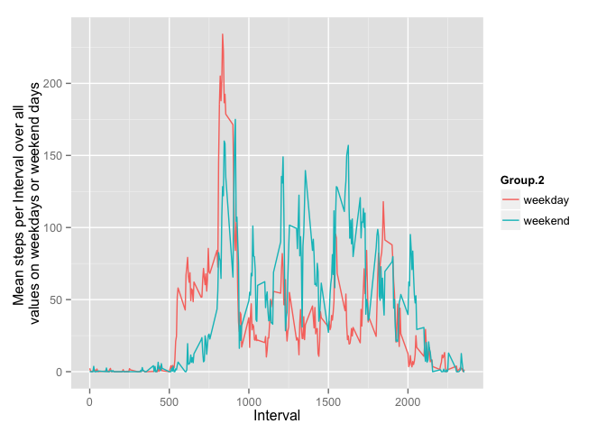

# Reproducible Research - Peer Assessment 1

## Loading and preprocessing the data


```r
setwd("/Users/sabine/Documents/Dokumente/Studium/Coursera/Data Science/5 Reproducible Research/PeerAssessment1")
data <- read.csv("activity.csv")
data$date <- as.Date(data$date)
```

## What is the mean total number of steps taken per day?

### Histogram showing total number of steps per day


```r
totalStepsPerDay <-aggregate(data[c("steps")], by=list(data$date), sum, na.rm=TRUE)
hist(totalStepsPerDay$steps)
```

 

### Mean and Median


```r
median <- median(totalStepsPerDay$steps)
mean <- mean(totalStepsPerDay$steps)
```

The mean of total number of steps per day is 9354.2295082, and the median is 10395.

## What is the average daily activity pattern?
### Time series plot of 5-minute interval and the average number of steps taken, averaged across all days (y-axis)


```r
data2 <- data[,-2]
aggdata <-aggregate(data2[c("steps")], by=list(data2$interval), mean, na.rm=TRUE)
plot(aggdata$Group.1,aggdata$steps,type="l")
```

 

### Which interval, on average across all the days in the dataset, contains the maximum number of steps?


```r
interval_max <- aggdata[aggdata$steps == max(aggdata$steps),1]
```

Interval 835 contains the maximum number of steps, on average across all the days in the dataset.

## Imputing missing values

### Calculate and report the total number of missing values in the dataset


```r
noOfMissingValues <- sum(is.na(data$steps))
```

Parameter *steps* has 2304 missing values.

### Devise a strategy for filling in all of the missing values in the dataset. 
Many intervals have value NA. In order to fill those "gaps" it is advised to 
substitute the NA values with the daily mean. The dayly mean is recommended over the
interval mean since a day having only NAs can not be filled with interval means
without further background information. Days without any measurements are set to 0.

### Create a new dataset that is equal to the original dataset but with the missing data filled in according to above advise.


```r
daylimean <-aggregate(data[c("steps")], by=list(data$date), mean, na.rm=TRUE)
names(daylimean)[1] <- "thedate"
daylimean$steps <- replace(daylimean$steps, is.na(daylimean$steps),0)

datawonan <- data
##datawonan$date <- as.Date(datawonan$date)
datawonan$steps <- as.numeric(datawonan$steps)

datawonan$steps <-replace(datawonan$steps,
                          is.na(datawonan$steps),
                          subset(daylimean, thedate == datawonan$date, select = c(steps))[1,1])
```

### Histogram showing total number of steps per day


```r
totalStepsPerDayWoNan <-aggregate(datawonan[c("steps")], 
                                  by=list(datawonan$date), sum, na.rm=TRUE)
hist(totalStepsPerDayWoNan$steps)
```

 

### Mean and Median


```r
medianwonan <- median(totalStepsPerDayWoNan$steps)
meanwonan <- mean(totalStepsPerDayWoNan$steps)
```

After removing the NAs the mean of total number of steps per day is 9354.2295082, and the median is 1.0395\times 10^{4}.

The values do not deviate from before, but probably should.

## Are there differences in activity patterns between weekdays and weekends?

## Preliminary Work
Create a new factor variable in the dataset with two levels – “weekday” and “weekend” indicating whether a given date is a weekday or weekend day.


```r
data <- data[,-4]
data <- cbind(data, weekdays(data$date))
names(data)[4] <- "weekday"
data$weekday <- as.character(data$weekday)
data$weekday[!data$weekday %in% c("Saturday", "Sunday")] <- "weekday"
data$weekday[data$weekday %in% c("Saturday", "Sunday")] <- "weekend"
unique(data$weekday)
```

```
## [1] "weekday" "weekend"
```

## Plotting
Make a panel plot containing a time series plot (i.e. type = "l") of the 5-minute interval (x-axis) and the average number of steps taken, averaged across all weekday days or weekend days (y-axis). See the README file in the GitHub repository to see an example of what this plot should look like using simulated data.


```r
library(ggplot2)
meanPerInteralAndWeekday <-aggregate(data[c("steps")], by=list(data$interval, data$weekday), mean, na.rm=TRUE)
ggplot(data=meanPerInteralAndWeekday, aes(x=Group.1, y=steps, group=Group.2, color=Group.2)) + ylab("Mean steps per Interval over all \nvalues on weekdays or weekend days") + xlab("Interval") + geom_line()
```

 
